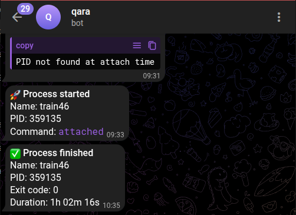
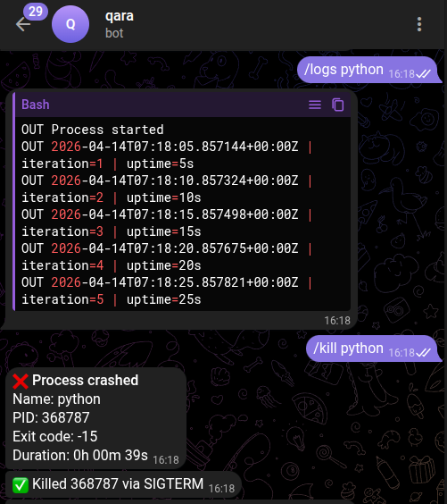

<div align="center">
  
</div>

<div align="center">
  <a href="https://pypi.org/project/qara/"></a>
  <a href="https://pypi.org/project/qara/"></a>
  <a href="https://github.com/warptengood/qara/blob/main/LICENSE"></a>
  <a href="https://github.com/warptengood/qara/actions/workflows/ci.yml"></a>
</div>

<br>

<div align="center">
  <strong>Watch any process. Get notified on Telegram. Control it remotely.</strong>
</div>

---

**qara** is a lightweight daemon that monitors processes and sends real-time notifications to Telegram. Start a long-running job, close your laptop, and stay in control from your phone.

Built for ML practitioners who run multi-hour training jobs, but works with any process.

```bash
qara run python train.py --name "gpt-finetune"
# => Telegram: "Process 'gpt-finetune' started (PID 41592)"
# => ... hours later ...
# => Telegram: "Process 'gpt-finetune' finished (exit 0, 3h 42m)"
```

<div align="center">
  
</div>

## Features

- **Spawn or attach** &mdash; start a new process with `qara run` or monitor an existing one with `qara attach <pid>`
- **Telegram notifications** &mdash; get notified on start, finish, and crash with configurable stdout tail
- **Remote control** &mdash; send `/status`, `/kill`, `/history`, `/logs` from Telegram
- **Plugin system** &mdash; extend with plugins via entry points (e.g. `qara-ml` for GPU metrics and loss tracking)
- **Daemon mode** &mdash; runs as a user-level service (systemd, launchd) &mdash; no root required
- **JSON output** &mdash; `--format json` on `status` and `history` for scripting

## Quickstart

### Install

```bash
# Install globally (recommended)
pipx install qara

# Or with uv
uv pip install qara
```

### Configure

```bash
qara config init
```

This creates `~/.config/qara/config.toml`. Open it and add your Telegram bot token and user ID:

```toml
[telegram]
bot_token = "123456:ABC-DEF..."
allowed_user_ids = [your_telegram_user_id]
```

<details>
<summary><strong>How to get a bot token and user ID</strong></summary>

1. Message [@BotFather](https://t.me/BotFather) on Telegram and send `/newbot`
2. Follow the prompts to name your bot &mdash; you'll receive a token like `123456:ABC-DEF...`
3. To find your user ID, message [@userinfobot](https://t.me/userinfobot) and it will reply with your numeric ID
4. **Important:** Send any message to your new bot first so it can message you back

</details>

### Start the daemon

```bash
qara daemon start
```

### Run a process

```bash
qara run python train.py --name "experiment-1"
```

That's it. You'll receive Telegram notifications when the process starts, finishes, or crashes.

## Usage

### Process management

```bash
# Run a process
qara run python train.py --name "my-job"

# Attach to an existing process
qara attach 12345 --name "background-job"

# List watched processes
qara status
qara status --format json

# View completed runs
qara history --last 10
qara history --format json
```

### Telegram commands

Once the daemon is running, send these commands to your bot:

| Command | Description |
|---------|-------------|
| `/status` | List all watched processes |
| `/kill <name>` | Send SIGTERM to a process (escalates to SIGKILL) |
| `/history` | Show recent completed runs |
| `/logs <name>` | Get last N lines of stdout |

<div align="center">
  
</div>

### Daemon management

```bash
qara daemon start              # Start in background
qara daemon start --foreground  # Start in foreground (for systemd/launchd)
qara daemon stop               # Stop the daemon
qara daemon status             # Check if daemon is running
```

### Install as a system service

```bash
# Auto-detects systemd (Linux) or launchd (macOS)
qara install

# Preview what would be installed
qara install --dry-run

# Remove the service
qara uninstall
```

## Configuration

Full `config.toml` reference:

```toml
[daemon]
log_level = "INFO"  # DEBUG, INFO, WARNING, ERROR

[telegram]
bot_token = "YOUR_BOT_TOKEN"
allowed_user_ids = [123456789]

[telegram.notifications]
on_start = true
on_finish = true
on_crash = true
stdout_tail_lines = 20  # lines of stdout included in finish notification

[commands]
enabled = ["status", "kill", "restart"]
kill_timeout_seconds = 10

[commands.allowed_scripts]
# alias = "/absolute/path/to/script.py"

[plugins]
enabled = ["ml"]

[plugins.ml]
gpu_poll_interval_seconds = 5
loss_pattern = ""  # custom regex, leave empty for default
```

## Plugins

qara's functionality can be extended through plugins. Plugins are installed separately and activated in `config.toml`:

```toml
[plugins]
enabled = ["ml"]
```

Plugins receive all events from the daemon (including per-line stdout/stderr) and can send their own Telegram summaries after a process finishes. New plugins can be distributed as standalone packages using Python's `importlib.metadata` entry points — no changes to qara core required.

Currently available:

### `qara-ml`

GPU metrics and training loss tracking for ML practitioners. Reports peak VRAM usage, average GPU utilisation, peak temperature, final loss, and best loss over the run.

```bash
pip install qara-ml
```

See [plugins/ml/README.md](plugins/ml/README.md) for full setup and configuration.

> More plugins coming in future releases.

## Architecture

```
qara daemon start
      │
      ▼
┌─────────────┐     ┌──────────────┐     ┌──────────────┐
│   Watcher    │────▶│  EventEngine │────▶│  Telegram    │
│  (per proc)  │     │  (pub/sub)   │     │  Channel     │
└─────────────┘     └──────┬───────┘     └──────────────┘
                           │
                    ┌──────┴───────┐
                    │   Plugins    │
                    │ (GPU, loss)  │
                    └──────────────┘
      ▲
      │ IPC (Unix socket)
      │
  qara run / qara status / ...
```

- **Watcher** spawns or attaches to processes via `asyncio.create_subprocess_exec`
- **EventEngine** is sequential async pub/sub &mdash; handlers receive events in subscription order
- **Plugins** subscribe directly to the engine and receive all events including stdout/stderr lines
- **NotificationBus** filters internal events before routing to channels
- **IPC** uses newline-delimited JSON over Unix sockets (Linux/macOS)

## Development

```bash
git clone https://github.com/warptengood/qara
cd qara
uv sync --group dev

# Run checks
uv run ruff check src/       # lint
uv run ruff format src/      # format
uv run mypy src/             # type check
uv run pytest                # tests
```

See [CONTRIBUTING.md](CONTRIBUTING.md) for guidelines.

## License

MIT &mdash; see [LICENSE](LICENSE) for details.
